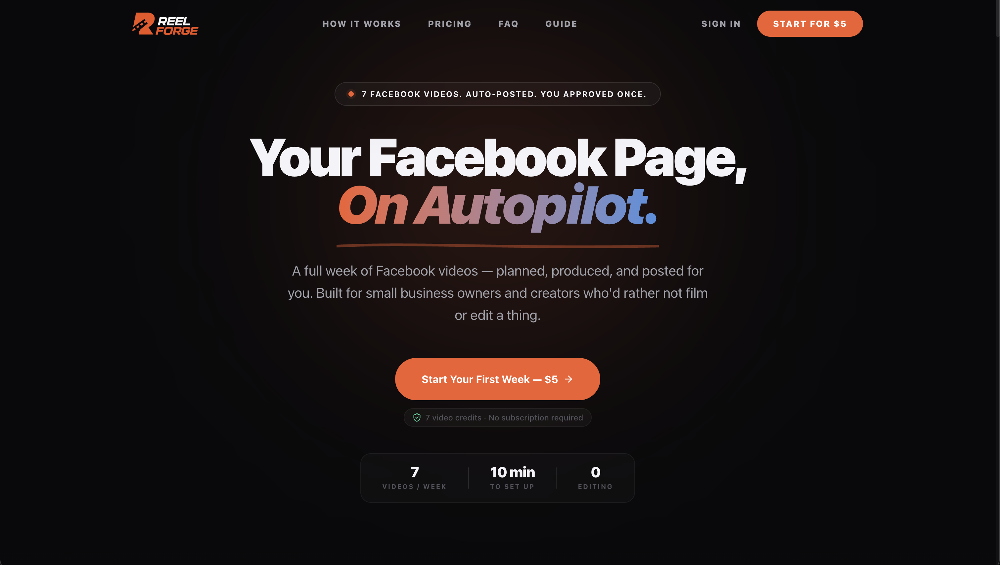
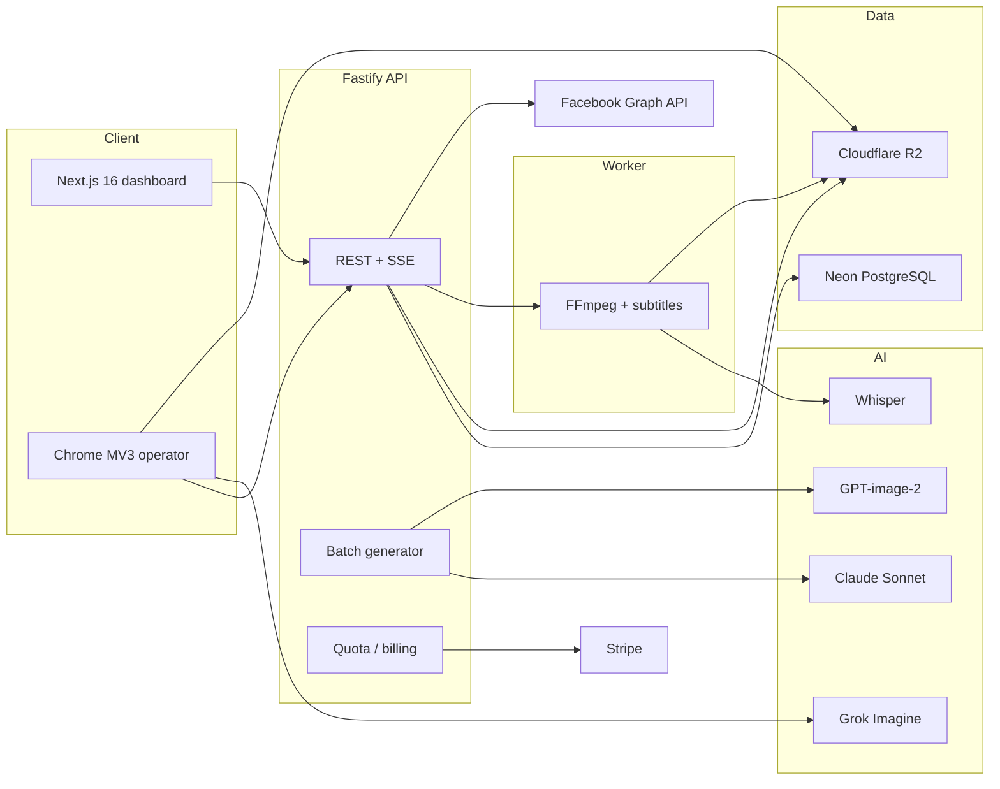
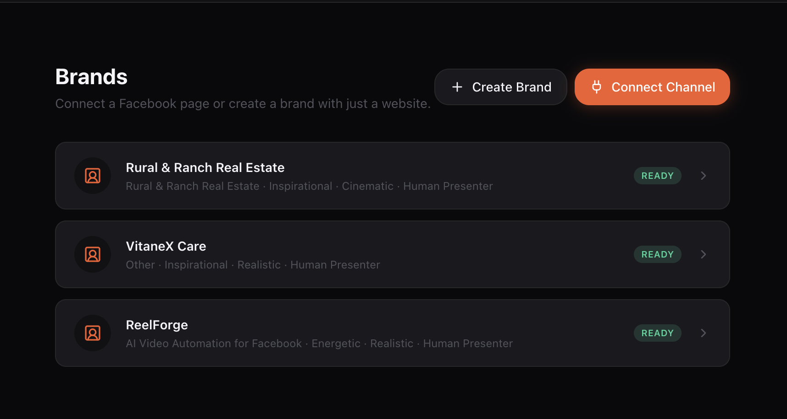
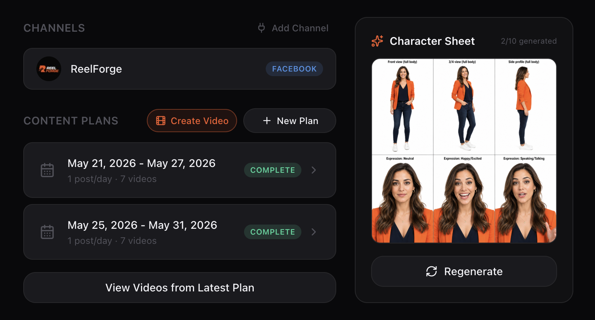
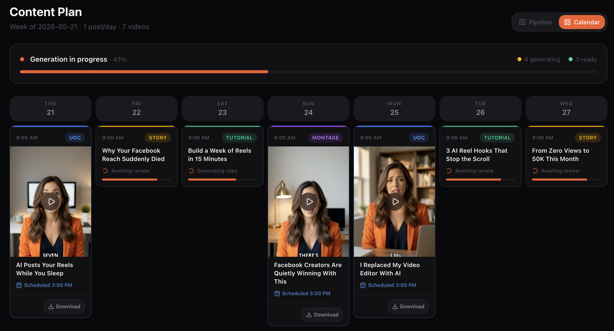
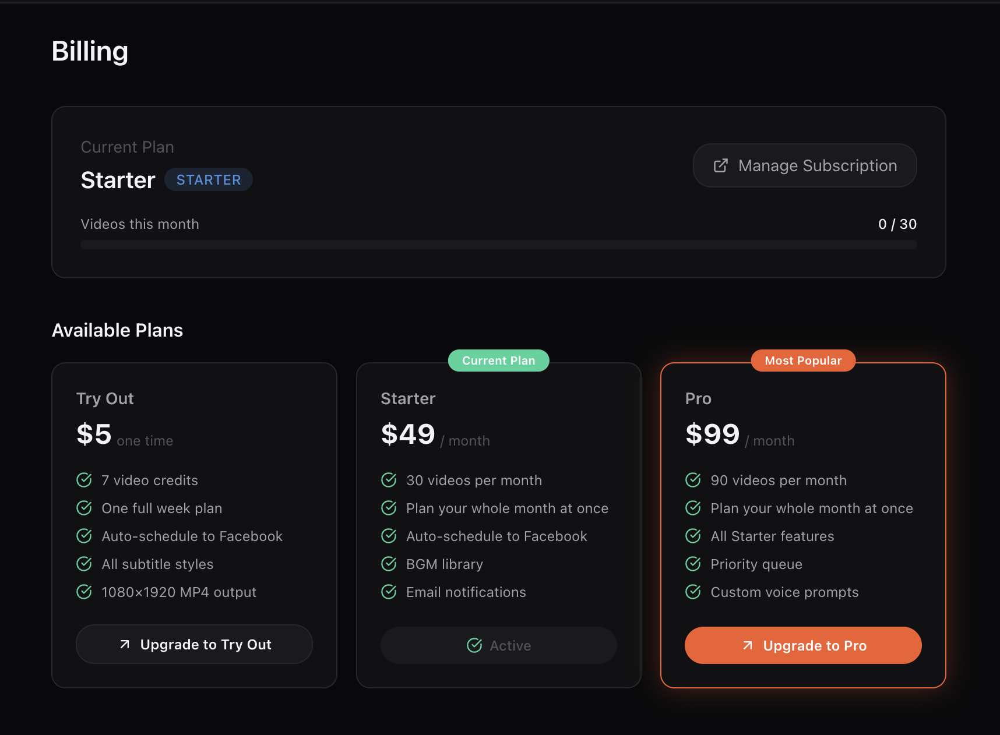

# ReelForge

**AI video generation platform that plans, produces, and auto-posts a week of Facebook Reels.**

Solo-built production system: TypeScript, Next.js, React, Node.js, Fastify, PostgreSQL, Drizzle ORM, Stripe, Clerk, Docker, FFmpeg, Claude, OpenAI, Chrome Extension (MV3).

[Live product](https://aireelforge.com) · [Case study](https://makereal.io/work/reelforge)

Mahbub Rahman — Senior Full-Stack AI Engineer, [Make Real LLC](https://makereal.io)


<p align="center">
  
</p>

---

## What it is

ReelForge is a **set-and-go content machine**. A user connects a Facebook Page, reviews an AI-generated brand profile, approves a week of topics, and the platform does the rest:

1. Claude writes scripts and splits them into scenes
2. A Chrome MV3 operator generates clips with Grok Imagine
3. An FFmpeg worker concatenates clips, burns Whisper subtitles, and mixes BGM
4. The finished 1080×1920 MP4 is stored on Cloudflare R2 and can auto-post to Facebook

This is a live SaaS product, not a tutorial or clone of a course project.

---

## What this codebase covers

Built **solo**: product, architecture, API, web app, billing, auth, LLM pipeline, video worker, and browser operator.

| Signal | What is in this codebase |
| --- | --- |
| Full-stack TypeScript | Next.js 16 app + Fastify 5 API + shared types package |
| AI / LLM systems | Claude (scripts, scenes, week plans), GPT-image-2 (character sheets), Grok Imagine (clips), Whisper (subtitles) |
| Backend / platform | REST APIs, SSE progress, Postgres schema, quota, Stripe webhooks, Facebook Graph |
| Distributed work | Clip claim queue, Docker FFmpeg worker, signed object storage, concurrency semaphore |
| Product / frontend | Dashboard, agentic onboarding, content calendar, billing, real-time pipeline UI |
| Production concerns | Auth (Clerk), subscriptions (Stripe), email (Resend), OAuth, state machines, idempotent posting |

---

## Architecture



**Monorepo (Turborepo + pnpm)**

```
apps/
  web/        Next.js 16 — landing, dashboard, billing, calendar
  api/        Fastify — domain API, Claude, Stripe, Facebook, jobs
  worker/     Docker FFmpeg assembler (concat, subtitles, BGM, upload)
  extension/  Chrome MV3 — claims clip jobs, drives Grok Imagine
  video/      Remotion — launch video and product screenshots
packages/
  types/      Shared domain types, enums, API contracts
  ui/         Shared React component library
  utils/      Pure helpers
```

---

## Generation pipeline

```
Connect Facebook Page
        ↓
Brand onboarding (Claude proposes niche, tone, audience, character)
        ↓
Character sheet (GPT-image-2) → stored on R2
        ↓
Week plan (Claude) → review topics in calendar UI
        ↓
Approve → batch generator (max 3 videos in flight)
        ↓
Per video: script → scenes → clip_requests
        ↓
Operator claims clips → Grok Imagine → upload MP4s to R2
        ↓
Worker: normalize → concat → Whisper subtitles → BGM → final MP4
        ↓
Auto-post to Facebook (draft / scheduled) or leave for download
        ↓
Email: video ready + week-complete summary
```

Each video is a **state machine**:

`DRAFT → SCRIPT → SCENES → CLIPS_QUEUED → CLIPS_PROCESSING → ASSEMBLY → COMPLETE | FAILED`

Failed clips can enter `CLIPS_NEEDS_REVIEW` instead of silently dying.

---

## Tech stack

| Layer | Technology |
| --- | --- |
| Language | TypeScript 5.9 (strict, shared across apps) |
| Web | Next.js 16, React 19, Tailwind CSS 4, Clerk |
| API | Node.js, Fastify 5, Zod, Clerk, Stripe, Resend |
| Database | PostgreSQL (Neon), Drizzle ORM, SQL migrations |
| Storage | Cloudflare R2 (S3-compatible signed uploads/downloads) |
| Auth | Clerk (web + API), Facebook OAuth for Pages |
| Billing | Stripe Checkout, Customer Portal, webhooks, plan quotas |
| LLM | Anthropic Claude (scripts, scenes, plans, dialogue) |
| Image | OpenAI GPT-image-2 (character sheets) |
| Video gen | xAI Grok Imagine, driven by a Chrome MV3 extension |
| Assembly | FFmpeg in Docker, Whisper transcription, burned subtitles |
| Realtime | Server-Sent Events (plan progress + per-video clip progress) |
| Tooling | Turborepo, pnpm workspaces, ESLint, Prettier, Vitest, GitHub Actions |

---

## Engineering highlights

**LLM orchestration, not a single prompt.** Scripts, scene splits, dialogue, week plans, titles, and captions are separate prompt modules with typed outputs. Brand context is injected so a week of videos stays on-voice.

**Operator pattern for video generation.** Clip jobs live in Postgres (`queued → processing → done/failed`). A Chrome extension claims work, runs Grok Imagine in a real browser tab, and uploads the result. The API never pretends a third-party generator is a stable HTTP API.

**Long-running work that the UI can watch.** Approving a week kicks off parallel video jobs (semaphore-capped). The dashboard subscribes over SSE and shows per-video status, clip progress, and calendar state.

**Payments and quota as a product surface.** One-time $5 trial, Starter/Pro subscriptions, Stripe webhooks, daily/monthly counters, and a pure `checkQuota()` gate that does not mutate usage. Quota is enforced before generation, not after.

**Video assembly as a worker, not a request.** A Docker worker downloads clips from R2, normalizes, concatenates, burns subtitles from Whisper, mixes BGM, and writes the final MP4. Homebrew FFmpeg is not the production path; the worker image is.

**Social posting is idempotent.** Facebook Graph uploads are recorded in `post_schedules`. Retries do not double-post. Plans support draft, scheduled, or download-only.

**Shared contracts.** `@repo/types` is the source of truth for enums, API shapes, and domain objects. The web app, API, and extension do not redeclare the model.

**CI on every PR.** GitHub Actions runs `pnpm lint` and `pnpm check-types` across the monorepo.

---

## Product screenshots

**Brand list and channel connect**



**Brand workspace — character sheet, plans, Facebook Page**



**Week calendar — generation in progress, scheduled posts**



**Billing — trial, Starter, Pro, Stripe portal**



---

## Database (high level)

PostgreSQL via Drizzle. Core tables:

| Table | Role |
| --- | --- |
| `users` | Clerk ID PK, plan, Stripe IDs, daily/monthly quota |
| `brand_profiles` | Niche, tone, visual style, character sheet path |
| `social_accounts` | Connected Facebook Pages |
| `content_plans` | Week of topics (JSONB), cadence, post mode |
| `videos` | Per-video state machine, script, output path |
| `scenes` | Prompt + duration per scene |
| `clip_requests` | Operator queue: claim, retry, done/failed |
| `post_schedules` | Facebook draft/scheduled/posted record |

---

## Status

**Live at [aireelforge.com](https://aireelforge.com).** Write-up: [makereal.io/work/reelforge](https://makereal.io/work/reelforge). This repository is the production codebase, published as a portfolio piece.

It is not an open-source starter and is not set up as a public clone-and-run project. If you are reviewing this for a role and want to walk through architecture, API contracts, or a specific subsystem, I am happy to do that in an interview.
